## airflow

Airflow 是一款强大的schedule engine，由Airbnb捐献给Apache，2019年列为Apache顶级项目。作为一款优秀的数据工作流管理引擎，被很多知名公司广泛应用。Airflow完全基于Python开发，具有非常强的可扩展和二次开发的能力。

Airflow的生态上跟其他大数据产品也能够很好的结合，比如AWS S3, Docker, Apache Hadoop HDFS, Apache Hive, Kubernetes, MySQL, Postgres, Apache Zeppelin等。

Airflow提供基于DAG的工作流编排进行分布式调度。用户需要通过Python编程式的定义工作流的DAG，可以定义一组有依赖的任务，按照依赖依次执行， 实现任务管理、调度、监控功能。此外提供WebUI可视化界面，提供了工作流节点的运行监控，查看每个节点的运行状态、运行耗时、执行日志等。

关于Airflow的概念、架构设计、使用方式等基础知识我们不在这里展开，我把一些参考资料放到文末供参考。本文主要介绍以下内容：

1. 本地部署一个airflow集群

2. 如何发布DAG到airflow并进行调度

3. 如何解决多租户隔离问题


### 集群部署

我们利用docker-compose来在Mac上部署一个airflow集群。我相关的脚本和配置放到[scripts/install-airflow](../../scripts/install-airflow/)下了。

```
$ cd scripts/install-airflow

$ ls -la
total 48
drwxr-xr-x  9 guangzhu  staff    288 Jul 13 10:23 .
drwxr-xr-x  4 guangzhu  staff    128 Jul 13 10:21 ..
-rw-r--r--  1 guangzhu  staff    101 Jul 13 10:23 .env
-rw-r--r--  1 guangzhu  staff     57 Jul 13 10:22 Dockerfile
-rwxr-xr-x  1 guangzhu  staff   1110 Jul 13 10:22 airflow.sh
drwxr-xr-x@ 6 guangzhu  staff    192 Jul 13 10:25 dags
-rw-r--r--  1 guangzhu  staff  10229 Jul 13 10:22 docker-compose.yaml
drwxr-xr-x@ 4 guangzhu  staff    128 Jul 13 10:25 logs
drwxr-xr-x@ 2 guangzhu  staff     64 Jul 13 10:22 plugins

$ docker-compose --profile flower up -d
WARNING: The AIRFLOW_UID variable is not set. Defaulting to a blank string.
Creating network "install-airflow_default" with the default driver
Creating volume "install-airflow_postgres-db-volume" with default driver
Creating install-airflow_redis_1    ... done
Creating install-airflow_postgres_1 ... done
Creating install-airflow_airflow-init_1 ... done
Creating install-airflow_flower_1            ... done
Creating install-airflow_airflow-webserver_1 ... done
Creating install-airflow_airflow-worker_1    ... done
Creating install-airflow_airflow-triggerer_1 ... done
Creating install-airflow_airflow-scheduler_1 ... done

$ docker-compose --profile flower ps
               Name                              Command                  State                    Ports
----------------------------------------------------------------------------------------------------------------------
install-airflow_airflow-init_1        /bin/bash -c function ver( ...   Exit 0
install-airflow_airflow-scheduler_1   /usr/bin/dumb-init -- /ent ...   Up (healthy)   8080/tcp
install-airflow_airflow-triggerer_1   /usr/bin/dumb-init -- /ent ...   Up (healthy)   8080/tcp
install-airflow_airflow-webserver_1   /usr/bin/dumb-init -- /ent ...   Up (healthy)   0.0.0.0:8080->8080/tcp
install-airflow_airflow-worker_1      /usr/bin/dumb-init -- /ent ...   Up (healthy)   8080/tcp
install-airflow_flower_1              /usr/bin/dumb-init -- /ent ...   Up (healthy)   0.0.0.0:5555->5555/tcp, 8080/tcp
install-airflow_postgres_1            docker-entrypoint.sh postgres    Up (healthy)   5432/tcp
install-airflow_redis_1               docker-entrypoint.sh redis ...   Up (healthy)   6379/tcp

```

就这样很简单的在本地部署起一个分布式的airflow集群，采用最常用的CeleryExecutor模式。至于CeleryExecutor是什么，可以参考[官方文档](https://airflow.apache.org/docs/apache-airflow/2.3.2/executor/index.html#executor-types)了解。

浏览器输入[http://localhost:8080/](http://localhost:8080/)打开Web UI，默认用户名为`airflow`，密码为`airflow`。

进入后点击`DAG`菜单，默认内置了很多example，这些example很好的解释了各种工作流编排模式，不同的operator的使用，是入门学习的非常好的资料。你可以直接通过UI来尝试调度运行，以及查看运行状态，运行log等。这里给出几个重要的页面：

1. DAGs 列表，查看目前部署的所有工作流

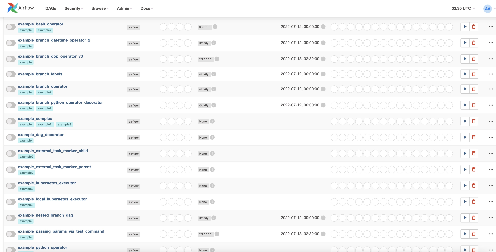

2. DAG的graph，点击某个DAG（这里以example_complex为例），可以以Graph方式查看拓扑

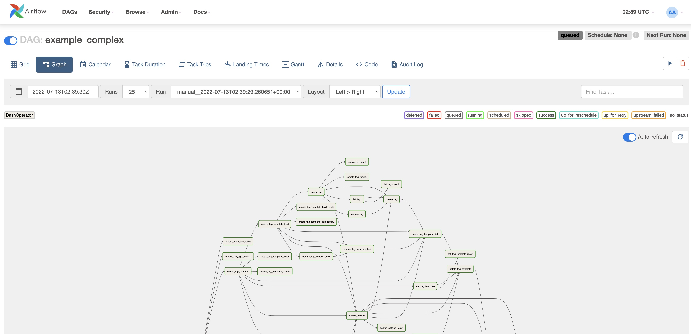

还可以以甘特图形式查看某次DAG运行的运行时长记录

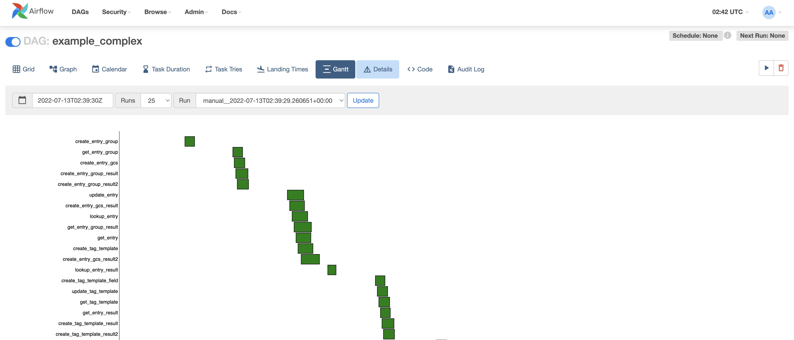

3. Bowse -> DAG Runs，查看所有DAG的运行记录

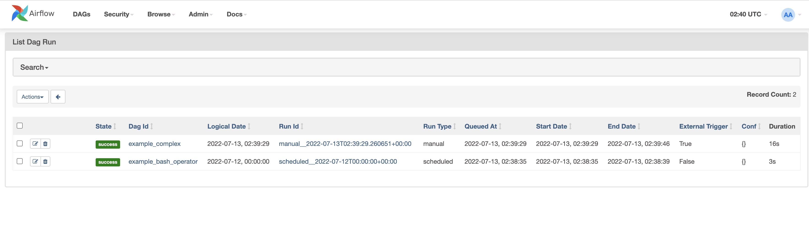

4. Browse —> Task Instances， 以Task视角查看所有DAG的Task的运行记录

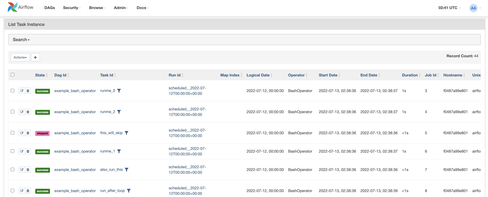

### 工作流发布与调度

Airflow的DAG默认只能以Python脚本的方式发布，以一个例子说明：

```
from datetime import timedelta

# The DAG object; we'll need this to instantiate a DAG
from airflow import DAG

# Operators; we need this to operate!
from airflow.operators.bash import BashOperator
from airflow.utils.dates import days_ago
# These args will get passed on to each operator
# You can override them on a per-task basis during operator initialization
default_args = {
    'owner': 'zhuguangbin',
    'depends_on_past': False,
    'email': ['airflow@example.com'],
    'email_on_failure': False,
    'email_on_retry': False,
    'retries': 1,
    'retry_delay': timedelta(minutes=5),
    # 'queue': 'bash_queue',
    # 'pool': 'backfill',
    # 'priority_weight': 10,
    # 'end_date': datetime(2016, 1, 1),
    # 'wait_for_downstream': False,
    # 'dag': dag,
    # 'sla': timedelta(hours=2),
    # 'execution_timeout': timedelta(seconds=300),
    # 'on_failure_callback': some_function,
    # 'on_success_callback': some_other_function,
    # 'on_retry_callback': another_function,
    # 'sla_miss_callback': yet_another_function,
    # 'trigger_rule': 'all_success'
}
dag = DAG(
    'airflow_tutorial',
    default_args=default_args,
    description='A simple tutorial DAG',
    schedule_interval=timedelta(days=1),
    start_date=days_ago(2),
    tags=['tutorial'],
)

# t1, t2 and t3 are examples of tasks created by instantiating operators
t1 = BashOperator(
    task_id='print_date',
    bash_command='date',
    dag=dag,
)

t2 = BashOperator(
    task_id='sleep',
    depends_on_past=False,
    bash_command='sleep 5',
    retries=3,
    dag=dag,
)
dag.doc_md = __doc__

t1.doc_md = """\
#### Task Documentation
You can document your task using the attributes `doc_md` (markdown),
`doc` (plain text), `doc_rst`, `doc_json`, `doc_yaml` which gets
rendered in the UI's Task Instance Details page.

"""
templated_command = """

    echo "{{ ds }}"
    echo "{{ macros.ds_add(ds, 7)}}"
    echo "{{ params.my_param }}"

"""

t3 = BashOperator(
    task_id='templated',
    depends_on_past=False,
    bash_command=templated_command,
    params={'my_param': 'Parameter I passed in'},
    dag=dag,
)

t1 >> [t2, t3]
```

以上Python代码还是比较简单和好理解的，对于有一定编程基础的同学来说，写这样的Python代码并不是特别困难的事，然后保存为`airflow_tutorial.py`，放到`DAG_FOLDER`目录(本文配置在安装目录的[dags](../../scripts/install-airflow/dags/)目录下，以Volume形式挂载给airflow的container)，airflow会自动识别探测到。

但是对于没有编程能力的分析师，这是一个很高的bar，我们在寻找一种更友好的定义DAG的方式，最好是像[Azkaban YAML](https://azkaban.readthedocs.io/en/latest/createFlows.html)的描述文件的方式来定义，这样既简单明了，也不用关心Python定义的DAG代码的语法错误测试问题。以此为基础，我们可以进一步封装成Canvas画布，通过拖拉拽的更友好的方式让用户编排DAG。

我们搜寻了一些方案，找到了一个开源项目gusty，github地址在[https://github.com/chriscardillo/gusty](https://github.com/chriscardillo/gusty)。gusty的目标跟上述的思路如出一辙，看来这是一个苦天下久已的痛点，我们来简单解释下gusty的原理。

gusty以YAML文件的方式来定义DAG和Task，每个DAG以一个独立的目录来存放，其中包含一个重要的METADATA.yml来描述DAG，包括DAGId、描述、Tag、调度周期、重试以及SLA策略等，而每个DAG的Task以一个独立的YAML文件描述，包括Task使用的Operator、参数以及Task之间的依赖等。

这里以一个例子[my_gusty_tutorial](../../scripts/install-airflow/dags/my_gusty_tutorial/)说明:

```
$ cd scripts/install-airflow/dags

$ ls -l
total 16
drwxr-xr-x  4 guangzhu  staff   128 Jul 13 10:25 __pycache__
-rw-r--r--@ 1 guangzhu  staff  2244 Jul 13 10:22 airflow_tutorial.py
-rw-r--r--@ 1 guangzhu  staff  1031 Jul 13 10:22 dags.py
drwxr-xr-x@ 7 guangzhu  staff   224 Jul 13 10:22 my_gusty_tutorial

$ ls -la
total 40
drwxr-xr-x@ 7 guangzhu  staff   224 Jul 13 10:22 .
drwxr-xr-x@ 6 guangzhu  staff   192 Jul 13 10:25 ..
-rw-r--r--@ 1 guangzhu  staff  1670 Jul 13 10:22 METADATA.yml
-rw-r--r--@ 1 guangzhu  staff    90 Jul 13 10:22 dummy.yml
-rw-r--r--@ 1 guangzhu  staff    65 Jul 13 10:22 print_date.yml
-rw-r--r--@ 1 guangzhu  staff   110 Jul 13 10:22 sleep.yml
-rw-r--r--@ 1 guangzhu  staff   285 Jul 13 10:22 templated.yml

$ cat METADATA.yml
# This DAG lines up one-to-one with the Airflow tutorial:
# https://airflow.apache.org/docs/stable/tutorial.html
description: "My Gusty version of the DAG described by this Airflow tutorial: https://airflow.apache.org/docs/stable/tutorial.html"
schedule_interval: "0 0 * * *"
tags:
  - tutorial
default_args:
    owner: zhuguangbin
    depends_on_past: false
    start_date: !days_ago 1
    email: airflow@example.com
    email_on_failure: false
    email_on_retry: false
    retries: 1
    retry_delay: !timedelta 'minutes: 5'
#   queue: bash_queue
#   pool: backfill
#   priority_weight: 10
#   end_date: !datetime [2016, 1, 1]
#   wait_for_downstream: false
#   sla: !timedelta 'hours: 2'
#   trigger_rule: all_success
doc_md: |-
  Hello and welcome to the gusty version of the basic Airflow tutorial. As you'll notice, this DAG looks exactly the same
  as the `airflow_tutorial` DAG, only that each task is specified in its own `.yml` file in a directory called `gusty_tutorial`.
  gusty's `create_dag` function just has to be pointed to this directory, and it will use your YAML specifications to construct the DAG.
  We believe that as your DAG incurs more tasks, especially if the majority of your tasks utilize the same handful of operators
  (e.g. generating tables in your data warehouse using SQL), being able to utilze to a file-based structure helps make your DAGs
  more managable.

  What's even nicer is **not every DAG needs to be a gusty-generated DAG!** This means you can try gusty out without having to commit to it.

  gusty even has some additional convenient features. Head over to the `more_gusty` DAG to see a full display of current features.

$ cat print_date.yml
operator: airflow.operators.bash.BashOperator
bash_command: date

$ cat sleep.yml
operator: airflow.operators.bash.BashOperator
bash_command: sleep 5
retries: 3
dependencies:
    - print_date


```

看起来很简洁易懂，这种描述性的YAML比Python编程式的代码更高效。

那怎么用呢？首先我们让Airflow支持gusty，这个玩意只是一个Python的包，你可以理解为一个“编译器”，将这些YAML的描述文件编译成标准的DAG Python。所以，其实还有一个“编译器”，就是在`DAG_FOLDER`dags目录下，有一个`dags.py`。

```
$ cat dags.py
import os
import airflow
from gusty import create_dag

#####################
## DAG Directories ##
#####################

# point to your dags directory
dag_parent_dir = os.path.join(os.environ['AIRFLOW_HOME'], "dags")

# assumes any subdirectories in the dags directory are Gusty DAGs (with METADATA.yml) (excludes subdirectories like __pycache__)
dag_directories = [os.path.join(dag_parent_dir, name) for name in os.listdir(dag_parent_dir) if os.path.isdir(os.path.join(dag_parent_dir, name)) and not name.endswith('__')]

####################
## DAG Generation ##
####################

for dag_directory in dag_directories:
    dag_id = os.path.basename(dag_directory)
    globals()[dag_id] = create_dag(dag_directory,
                                   tags = ['default', 'tags'],
                                   task_group_defaults={"tooltip": "this is a default tooltip"},
                                   wait_for_defaults={"retries": 10, "check_existence": True},
                                   latest_only=False)

```

以上代码很容易理解，就是遍历`DAG_FOLDER`下的各个子目录（每个子目录为一个gusty的工作流），然后解析YAML调用`create_dag`生成标准Airflow的DAG对象。

至此，原理解释清楚了。我们开干，来尝试一下。首先我们将官方的airflow支持gusty，重新build一个自己的docker image，Dockerfile在[这里](../../scripts/install-airflow/Dockerfile)，很简单，就是利用pip安装gusty python lib即可。

```
$ cat Dockerfile
FROM apache/airflow:2.3.2

RUN pip3 install gusty==0.6.0
```

然后我们重新build一个`apache/airflow:2.3.2-gusty`的image：

```
$ docker build . -t apache/airflow:2.3.2-gusty
[+] Building 0.2s (6/6) FINISHED
 => [internal] load build definition from Dockerfile                                                                                                                         0.0s
 => => transferring dockerfile: 99B                                                                                                                                          0.0s
 => [internal] load .dockerignore                                                                                                                                            0.0s
 => => transferring context: 2B                                                                                                                                              0.0s
 => [internal] load metadata for docker.io/apache/airflow:2.3.2                                                                                                              0.0s
 => [1/2] FROM docker.io/apache/airflow:2.3.2                                                                                                                                0.0s
 => CACHED [2/2] RUN pip3 install gusty==0.6.0                                                                                                                               0.0s
 => exporting to image                                                                                                                                                       0.0s
 => => exporting layers                                                                                                                                                      0.0s
 => => writing image sha256:01944a9b981b9fdd8bfca185e71dc98d4741c3fda3a395d237633d6f51e1620f                                                                                 0.0s
 => => naming to docker.io/apache/airflow:2.3.2-gusty                                                                                                                        0.0s

```

修改`.env`，将`AIRFLOW_IMAGE_NAME`改成重新build的image版本

```
$ cat .env
AIRFLOW_IMAGE_NAME=apache/airflow:2.3.2-gusty
AIRFLOW__SCHEDULER__SCHEDULE_AFTER_TASK_EXECUTION=true
```

重启集群：
```
$ docker-compose --profile flower restart
Restarting install-airflow_airflow-scheduler_1 ... done
Restarting install-airflow_airflow-triggerer_1 ... done
Restarting install-airflow_airflow-worker_1    ... done
Restarting install-airflow_airflow-webserver_1 ... done
Restarting install-airflow_flower_1            ... done
Restarting install-airflow_airflow-init_1      ... done
Restarting install-airflow_postgres_1          ... done
Restarting install-airflow_redis_1             ... done
```

这样就大功告成了。进入Web UI，可以看到我们用YAML定义的`my_gusty_tutorial` DAG了。

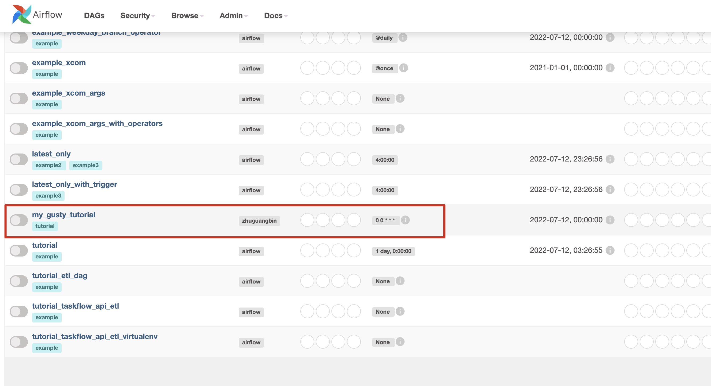


经过这样一番操作，是不是以后发布工作流，就只需要将工作流相关的YAML文件打包成一个目录，丢到`DAG_FOLDER`下就可以了，so easy。

后续看是否可以改造下Airflow的API，再补充两个api，**支持通过API方式deploy和delete gusty DAG**，这样就不需要手工操作，全部都支持airflow API了。


### 多租户隔离问题解决方案
 
Airflow的多租户方案做的很烂，严格意义上并没有真正的多租户方案，这个源于一开始设计上就没考虑这点。完整的多租户方案，需要至少满足以下几点：

1. 账号权限和资源的隔离。比如A账号创建的DAG只能A来看到和操作，不能被B可见。

2. 登录账号和实际Task的运行账号的隔离。登录账号、DAG的Owner账号、DAG中Task真正被调度执行时的进程账号，三者需要一致且隔离。这样A账号登录，创建的DAG，对DAG的操作，都可以隔离并且被audit，而Task执行时拉起来的shell进程/python进程/spark进程也应该可以做到以指定的账号运行而不是固定的daemon账号，Task产出的数据也应该以执行账号的权限生成。

**对于第一点**，Airflow的Security支持一个简单的RBAC模型。定义User、Role、Permission之间的关联关系。而Permission可以细粒度到DAG级别，也就是可以定义一组DAG的Read/Write/Delete权限，作为一个Role（我们可以称之为项目，也就是这个项目下包含一组DAG，以项目粒度来做资源和权限的隔离）。

我们以一个例子演示说明：

假设我们有一个项目叫`tutorial`，我们希望这一个项目下的DAG仅被该项目的成员可见，而不被其他人可见而误操作。项目内的DAG的操作也应该能被项目内的不同的人可见，但有不同的权限级别，比如：

1. Read/Write/Delete全部权限的`tutorial_admin`
2. 只有Read的普通`tutorial_user`

我们基于默认的User复制两个新的Role：`tutorial_admin`和`tutorial_user`。
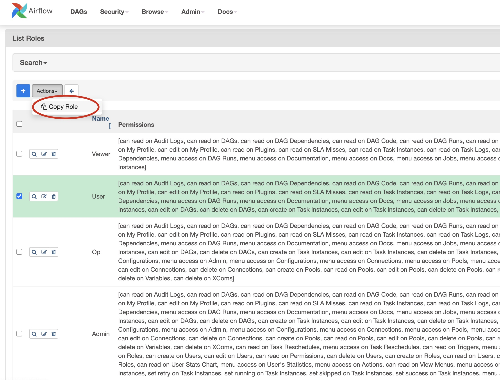

编辑这个`tutorial_admin` Role的权限，添加该项目中的DAG的Read/Write/Delete权限，假设该tutorial项目下包含我们上述的`my_gusty_tutorial` DAG，操作如下：
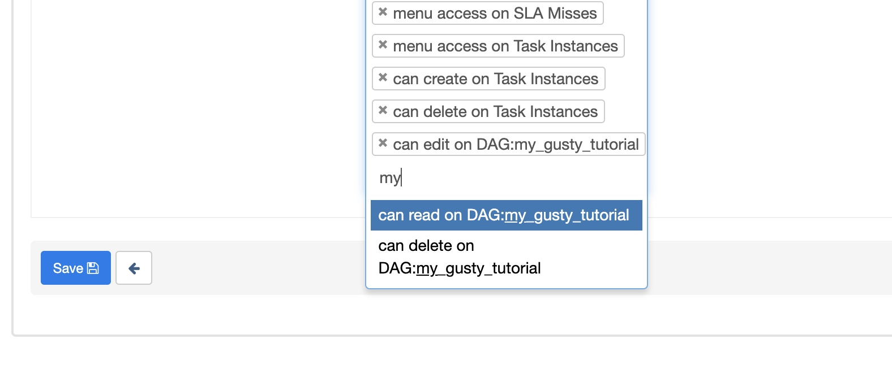

最后一定要记得，删除默认的全局DAG的权限：
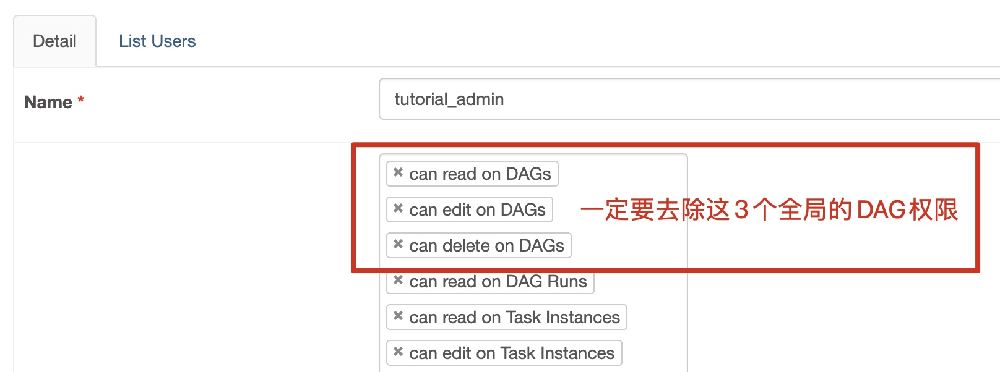

这样这个`tutorial_admin`的Role就完成了，如果后续该项目下新增了DAG，更新该Role的Permission列表添加相应的DAG权限即可。`tutorial_user` 同理，只是注意只有Read权限。

有了该`tutorial`项目的两个级别的权限，我们就可以将User绑定到相应的权限上就可以了。

假设`zhuguangbin`作为`tutorial`项目的admin：
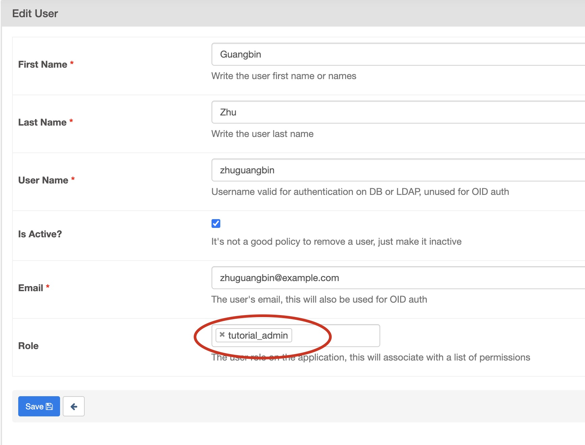

另有一个`tutorial_user`的只读账号可以访问`tutorial`项目但是不能操作：
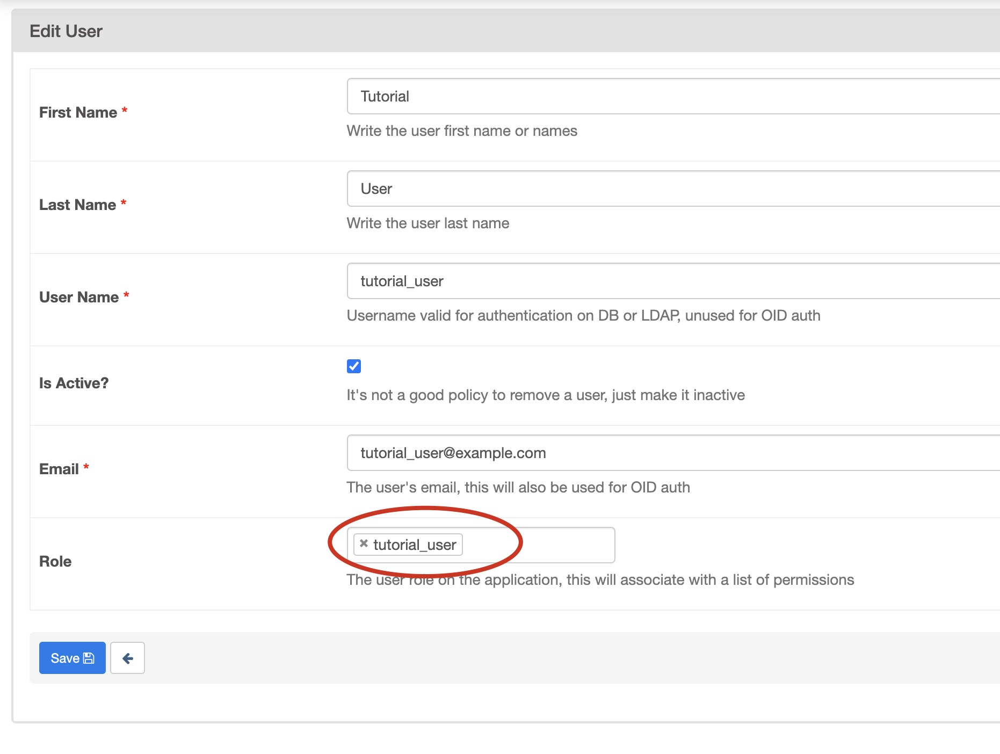

我们以两个不同的账号分别登录，

`zhuguangbin`作为`tutorial`项目的admin，只能看到`tutorial`的DAG，不能看到其他项目的DAG，且拥有该项目下DAG的全部操作权限：

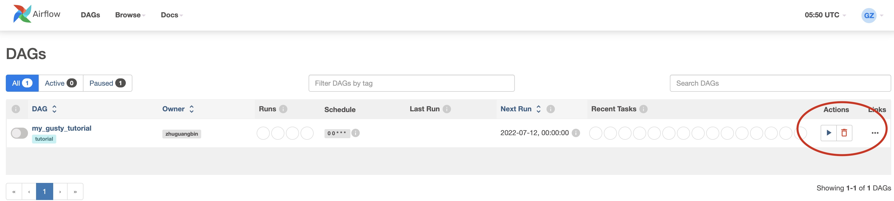

而`tutorial_user`作为`tutorial`项目的只读访问账号，也只能看到`tutorial`的DAG，不能看到其他项目的DAG，且只能拥有该项目下DAG的查看权限，不能执行运行和删除操作（灰色）：
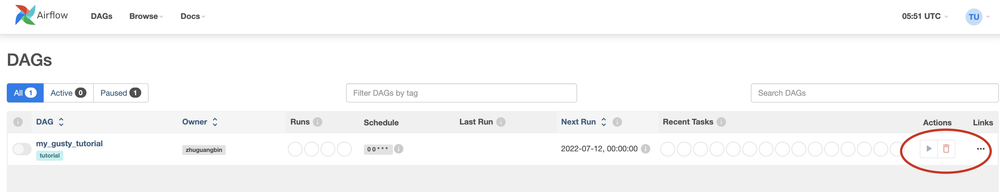

以上，关于多租户的第一个隔离，就可以通过这种方式来实现。这些操作除了在Web UI上操作，也可以通过cli或者REST API来操作，方便平台集成。

**对于第二点**，实际上现在并没有特别好的办法，官方有个[AIP-1: Improve Airflow Security](https://cwiki.apache.org/confluence/display/AIRFLOW/AIP-1%3A+Improve+Airflow+Security)，但是进度缓慢，看来遥遥无望。

对于访问hadoop，可以通过kerberos来做身份认证，而不是Simple的daemon账号统一访问。所以，在这个层面上，即使airflow的Executor统一用airflow daemon账号，并且调起Task子进程的执行账号也是airflow daemon账号，也能够通过Task的kerberos身份访问hadoop，实现身份和权限的隔离。

对于没有开启kerberos的hadoop，如果要做这层隔离，只能可以采取不同的项目或者部门单独部署不同的airflow集群，不同集群的Executor daemon账号采用不同账号的方式来做到集群级别的硬隔离。

这里可以参考一个[Stack Overflow上的Thread讨论](https://stackoverflow.com/questions/68617487/apache-airflow-working-with-multi-teams-multi-tenant)


### 参考资料

1. [Airflow 官方文档](https://airflow.apache.org/docs/apache-airflow/2.3.2/index.html)
2. [Airflow 基本概念](https://airflow.apache.org/docs/apache-airflow/2.3.2/concepts/index.html)
3. [Airflow Operators](https://airflow.apache.org/docs/apache-airflow/2.3.2/concepts/operators.html)
4. [Airflow Executor](https://airflow.apache.org/docs/apache-airflow/2.3.2/executor/index.html#executor-types)
5. [Airflow Plugin](https://airflow.apache.org/docs/apache-airflow/2.3.2/plugins.html)
6. [Airflow 实践笔记-从入门到精通一](https://mp.weixin.qq.com/s?__biz=MzUxOTU5Mjk2OA==&mid=2247488280&idx=1&sn=091a533f2dd246de0423afbf7eca8025)
7. [Airflow 实践笔记-从入门到精通二](https://mp.weixin.qq.com/s/i4c0i9-mAGsgFC-KvMPJ_Q)
8. [Airflow 实践笔记-从入门到精通三](https://mp.weixin.qq.com/s/34mRFDCKj9rMHpKuAMbN7w)
9. [Airflow Security](https://airflow.apache.org/docs/apache-airflow/2.3.2/security/access-control.html)
10. [Airflow Multi Tenant StackOverflow Thread](https://stackoverflow.com/questions/68617487/apache-airflow-working-with-multi-teams-multi-tenant)

