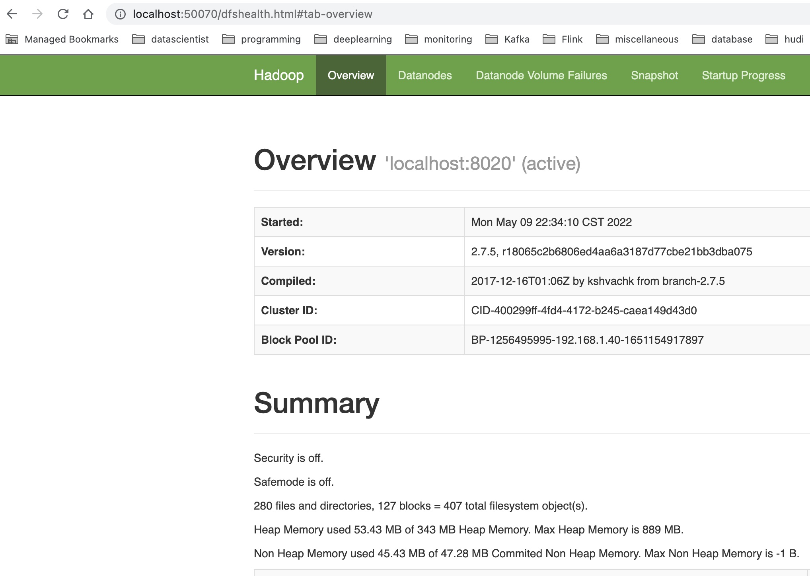
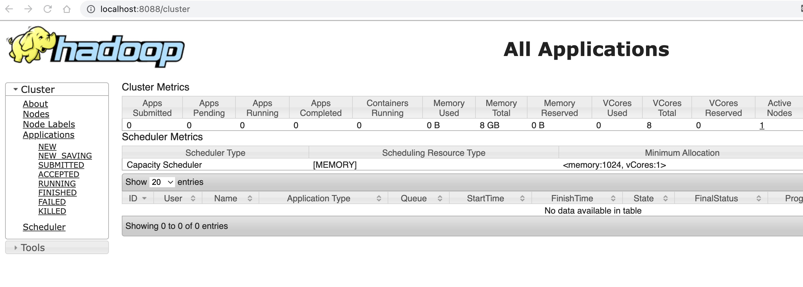
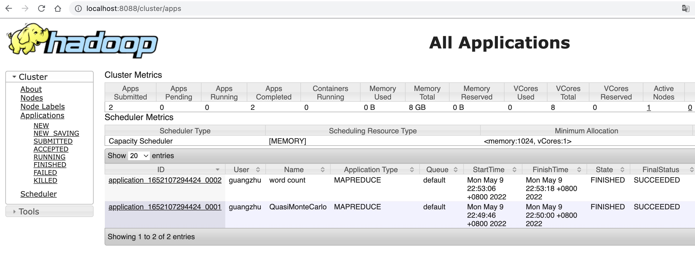

## Hadoop

1. 下载hadoop安装包

```
sudo wget -P /opt/ https://archive.apache.org/dist/hadoop/common/hadoop-2.7.5/hadoop-2.7.5.tar.gz
cd /opt
sudo tar zxvf hadoop-2.7.5.tar.gz
sudo ln -nsf hadoop-2.7.5 hadoop
```

2. 配置hadoop配置文件

hadoop的配置文件非常复杂，我们只需要配置最基本的，能让它部署为一个单机伪分布式集群即可。这里我给出一份我的配置，你可以直接拿来用，放到conf/hadoop下了。

我们约定所有大数据系统的配置文件和安装包分离，安装包统一在/opt/{组件}下，并用软连接来做我们想要使用版本的链接（因为你可能部署同一个组件的多个版本）。

而配置我们统一在/etc/{组件}/conf，conf同样做软连接到你的配置文件路径。这样以便于统一做管理和多个配置的切换。

熟悉Linux的同学，可能理解我这样配置的逻辑。Linux文件系统中，安装包也是遵循这样的原则。而配置文件的多版本管理，在Linux中有一套`alternative`机制，我们这里简化了，直接用软连接来解决。

以hadoop为例，配置文件我们放到`/etc/hadoop/conf`下

```
sudo mkdir /etc/hadoop
cd /etc/hadoop
sudo ln -nsf ~/Code/github/zhuguangbin/bigdata-mac-playground/conf/hadoop/conf.local conf
```

以上`~/Code/github/zhuguangbin/bigdata-mac-playground/conf/hadoop/conf.local`  是我的Mac上的配置的路径，你需要根据实际情况来配置

3. 环境变量

将以下环境变量加入你的当前用户环境，我用zsh，所以加入我的~/.zshrc。

```
export JAVA_HOME=`/usr/libexec/java_home -v 1.8.0`

export HADOOP_HOME=/opt/hadoop
export HADOOP_CONF_DIR=/etc/hadoop/conf
export HADOOP_OPTS="-Djava.library.path=${HADOOP_HOME}/lib/native"
export LD_LIBRARY_PATH=$LD_LIBRARY_PATH:${HADOOP_HOME}/lib/native
export JAVA_LIBRARY_PATH=$JAVA_LIBRARY_PATH:${HADOOP_HOME}/lib/native
export HADOOP_CLASSPATH=`$HADOOP_HOME/bin/hadoop classpath`
export PATH=$PATH:$HADOOP_HOME/bin
```

source 使生效
```
source ~/.zshrc
```
至此hadoop安装配置完成，我们通过以下命令验证下安装

```
hadoop version
```

以下是我的输出，如果你的也是，恭喜你，已经成功，接下来我们启动集群。

```
Hadoop 2.7.5
Subversion https://shv@git-wip-us.apache.org/repos/asf/hadoop.git -r 18065c2b6806ed4aa6a3187d77cbe21bb3dba075
Compiled by kshvachk on 2017-12-16T01:06Z
Compiled with protoc 2.5.0
From source with checksum 9f118f95f47043332d51891e37f736e9
This command was run using /opt/hadoop-2.7.5/share/hadoop/common/hadoop-common-2.7.5.jar
```
4. 初始化NameNode

NameNode是Hadoop HDFS的元数据核心，需要先format初始化文件系统才能使用。你可以理解为，你新买了个一个U盘，需要先格式化后才能用，一个道理。

执行以下命令，

```
hadoop namenode -format
```

 当出现以下提示时，输入Y确认即可:
 ```
 format filesystem in Storage Directory /data/dfs/nn ? (Y or N) Y
 ```

 还记得在基础配置中，我们要求`/data`目录么，这里的`/data/dfs/nn`就是Hadoop HDFS的核心元数据存储，这个目录非常重要，如果你不是特别了解，请不要误删其中的数据，不能丢。这也是我们为什么不按照默认配置放到`/tmp/dfs/nn`下的原因。

 5. 接下来我们就可以启动hadoop集群了，先启动HDFS，

 ```
# guangzhu @ C02GM22AMD6T in /opt/hadoop [22:33:49] 
$ ls -l
total 216
-rw-r--r--   1 guangzhu  staff  86424 Dec 16  2017 LICENSE.txt
-rw-r--r--   1 guangzhu  staff  14978 Dec 16  2017 NOTICE.txt
-rw-r--r--   1 guangzhu  staff   1366 Dec 16  2017 README.txt
drwxr-xr-x  13 guangzhu  staff    416 Jan 31  2021 bin
drwxr-xr-x   3 guangzhu  staff     96 Dec 16  2017 etc
drwxr-xr-x   7 guangzhu  staff    224 Jun  7  2020 include
drwxr-xr-x   4 guangzhu  staff    128 Jul 31  2020 lib
drwxr-xr-x  12 guangzhu  staff    384 Jun  7  2020 libexec
drwxr-xr-x  22 guangzhu  staff    704 Apr 29 11:57 logs
drwxr-xr-x  30 guangzhu  staff    960 Jun  7  2020 sbin
drwxr-xr-x   3 guangzhu  staff     96 Mar 20  2020 share

# guangzhu @ C02GM22AMD6T in /opt/hadoop [22:33:50] 
$ sbin/start-dfs.sh 
Starting namenodes on [localhost]
localhost: starting namenode, logging to /opt/hadoop-2.7.5/logs/hadoop-guangzhu-namenode-{HOSTNAME}.out
localhost: starting datanode, logging to /opt/hadoop-2.7.5/logs/hadoop-guangzhu-datanode-{HOSTNAME}.out
Starting secondary namenodes [0.0.0.0]
The authenticity of host '0.0.0.0 (0.0.0.0)' can't be established.
ED25519 key fingerprint is SHA256:g0am9FG+hmt5D7Vw7r1HK4MC3u1DLtVzdkOjmGmU34k.
This host key is known by the following other names/addresses:
    ~/.ssh/known_hosts:2: localhost
Are you sure you want to continue connecting (yes/no/[fingerprint])? yes
0.0.0.0: Warning: Permanently added '0.0.0.0' (ED25519) to the list of known hosts.
0.0.0.0: starting secondarynamenode, logging to /opt/hadoop-2.7.5/logs/hadoop-guangzhu-secondarynamenode-{HOSTNAME}.out

# guangzhu @ C02GM22AMD6T in /opt/hadoop [22:34:35] 
$ jps
15521 SecondaryNameNode
15603 Jps
15305 NameNode
15404 DataNode
 ```

 可以通过浏览器打开HDFS NameNode 的Web UI：

 `http://localhost:50070/`

 

 6. 我们接下来启动YARN

 ```
 $ sbin/start-yarn.sh 
starting yarn daemons
starting resourcemanager, logging to /opt/hadoop-2.7.5/logs/yarn-guangzhu-resourcemanager-{HOSTNAME}.out
localhost: starting nodemanager, logging to /opt/hadoop-2.7.5/logs/yarn-guangzhu-nodemanager-{HOSTNAME}.out

# guangzhu @ C02GM22AMD6T in /opt/hadoop [22:41:35] 
$ jps
15521 SecondaryNameNode
16038 Jps
15305 NameNode
15404 DataNode
15999 NodeManager
15903 ResourceManager

 ```

通过浏览器打开YARN ResourceManager的WebUI：

`http://localhost:8088/`



至此，hadoop伪分布式集群已经在你的Mac上部署成功了。快来体验一下吧。

7. hadoop初体验

```
hadoop fs -ls /
hadoop fs -mkdir /tmp
hadoop fs -mkdir /user/{YOUR_MAC_ACCOUNT_NAME}
```

跑一个MapReduce程序，Pi，求Pi值。

```
$ cd /opt/hadoop
$ hadoop jar share/hadoop/mapreduce/hadoop-mapreduce-examples-2.7.5.jar pi 4 1
```

再跑一个wordcount吧，

```
$ hadoop fs -mkdir /tmp/wc-in
$ hadoop fs -put README.txt /tmp/wc-in/
$ hadoop fs -ls /tmp/wc-in/
Found 1 items
-rw-r--r--   1 guangzhu supergroup       1366 2022-05-09 22:52 /tmp/wc-in/README.txt

$ hadoop jar share/hadoop/mapreduce/hadoop-mapreduce-examples-2.7.5.jar wordcount /tmp/wc-in /tmp/wc-out

$ hadoop fs -ls /tmp/wc-out/
Found 2 items
-rw-r--r--   1 guangzhu supergroup          0 2022-05-09 22:53 /tmp/wc-out/_SUCCESS
-rw-r--r--   1 guangzhu supergroup       1306 2022-05-09 22:53 /tmp/wc-out/part-r-00000

$ hadoop fs -cat /tmp/wc-out/part-r-00000 
(BIS),	1
(ECCN)	1
(TSU)	1
(see	1

```

去YARN的WebUI上我们看一下运行历史：

`http://localhost:8088/cluster/apps`

