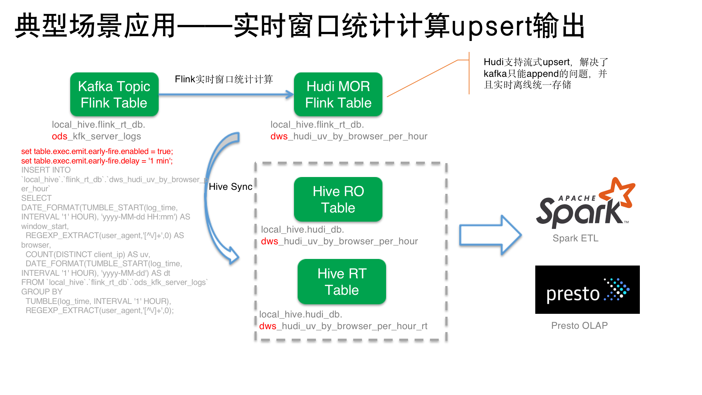

## hudi

Hudi（Hadoop Upserts anD Incrementals）是目前市面上流行的三大开源数据湖方案之一，用于管理分布式文件系统 DFS 上大型分析数据集存储。
我个人不太喜欢数据湖这个词，因为这个名词过于概念化抽象化，而且不同的角色对其有不同的理解。比如云厂商更多看重它包罗万象大一统的统一存储计算能力，既支持传统数仓的结构化存储，又支持二进制、图片等非结构化数据，同提供统一的引擎在湖上处理和分析，而避免传统数仓需要出仓分析的数据不一致和孤岛问题。
而在企业内部数据建设上，我更喜欢把它当作LakeHouse建设中的一个关键层次：表格式管理。或者对应到数据库技术的存储引擎相关的技术。相对于传统的Hive，其核心能力主要有以下：

1. ACID与事务支持：支持HDFS之上的update/delete，并通过MVCC提供多版本事务隔离。参考[支持的操作](https://hudi.apache.org/docs/write_operations)和[MVCC](https://hudi.apache.org/docs/concurrency_control)这两部分官方文档。

2. 端到端的流的支持：能够流式的对表进行插入/更新/删除操作。直白点说，就是支持Flink Streaming的upsert。

3. 更灵活的schema evolution：Hive只支持在字段后追加字段且不能删除无效字段，Hudi对schema的管理更加灵活，支持字段的增删改移，详见[schema演进](https://hudi.apache.org/docs/schema_evolution)官方文档。

4. 细粒度的查询性能优化以及用户无关的数据管理：可以利用索引以及列统计信息等降低IO提升查询性能。而对于表的管理如compaction/clustering/cleaning/Auto Filesizing等操作，是无需用户ETL参与的，这实际上将ETL生产逻辑和表的治理逻辑分开，更加有利于数据治理和优化。

5. 多引擎支持：支持主流的计算引擎，如Hive/Spark/Flink/Presto/Trino等。

关于数据湖或者Hudi有非常多的概念和理论，读者可以去官方文档或者其他资料了解，我们不在这里展开，贴一张Hudi官网的图：


在这一节，我们介绍Hudi构建LakeHouse的部署方案。

基本思路是，基于HDFS分布式文件系统构建Hudi数据湖层，Hive既作为传统数仓，又作为Hudi的Metastore。
数据源有两类：一类是日志消息存储在Kafka等消息系统，另一类是DB中的事务数据。我们通过Flink消费他们实时摄入湖中。
ETL层面：离线通过Spark对Hudi进行增量生产，实时也会通过Flink NRT（近实时）的产出到湖中。当然在复杂场景下，其实实时和离线已经不那么绝对，比如Flink Streaming可以实时消费Hudi作为数据源，甚至也可以Kafka Join Hudi。在批流一体的概念里，都是抽象为DynamicTable。
分析查询层面：Spark/Presto都可以作为Hudi湖上的NRT分析引擎。

以上集成方案，需要hadoop/hive/spark/kafka/flink/presto提前部署好，可以参考前面几节的内容。在部署Hudi之前，请提前启动hadoop集群、Hive MetaStoreServer、Kafka集群、Flink集群、Presto集群。

如果以上都准备好，我们开始Hudi的集成安装配置。

### Hudi与Flink的集成安装配置

Hudi与Flink的集成比较简单，Hudi是作为Table/SQL connector与Flink集成的。目前支持Flink 1.13和1.14两个版本。

```
$cd /opt/flink/ext-lib
$wget -P /opt/flink/ext-lib https://repo.maven.apache.org/maven2/org/apache/hudi/hudi-flink1.14-bundle_2.12/0.11.0/hudi-flink1.14-bundle_2.12-0.11.0.jar

$ ls -l
total 354160
-rw-r--r--  1 guangzhu  staff   3232770 Apr 11 11:17 derby-10.14.2.0.jar
-rw-r--r--  1 guangzhu  staff    250229 Apr 11 10:27 flink-connector-jdbc_2.12-1.14.4.jar
-rw-r--r--  1 guangzhu  staff   2288121 Apr 12 12:00 flink-faker-0.4.1.jar
-rw-r--r--  1 guangzhu  staff   3816117 Apr 11 10:29 flink-sql-avro-1.14.4.jar
-rw-r--r--  1 guangzhu  staff   8842209 Apr 11 10:30 flink-sql-avro-confluent-registry-1.14.4.jar
-rw-r--r--  1 guangzhu  staff  27752238 Apr 11 10:29 flink-sql-connector-elasticsearch7_2.12-1.14.4.jar
-rw-r--r--  1 guangzhu  staff  30995862 Apr 11 10:33 flink-sql-connector-hbase-2.2_2.12-1.14.4.jar
-rw-r--r--  1 guangzhu  staff  42147708 Apr 11 10:39 flink-sql-connector-hive-2.3.6_2.12-1.14.4.jar
-rw-r--r--  1 guangzhu  staff   3704559 Apr 11 10:27 flink-sql-connector-kafka_2.12-1.14.4.jar
-rw-r--r--  1 guangzhu  staff   2078983 Apr 11 10:31 flink-sql-orc_2.12-1.14.4.jar
-rw-r--r--  1 guangzhu  staff   5593715 Apr 11 10:30 flink-sql-parquet_2.12-1.14.4.jar
-rw-r--r--  1 guangzhu  staff  47340482 May  4 20:25 hudi-flink1.14-bundle_2.12-0.11.0.jar
-rw-r--r--  1 guangzhu  staff   2330539 Apr 11 11:16 mysql-connector-java-8.0.18.jar
-rw-r--r--  1 guangzhu  staff    932808 Apr 11 11:16 postgresql-42.2.14.jar
```

这样就可以了。我们在后边介绍如何使用。

### Hudi与Spark的集成安装配置

Hudi与Spark是通过Spark的SQL extension集成的，所以，我们除了下载Hudi与Spark的bundle包以外，还需要配置`spark-defaults.conf`使其生效。当然你也可以通过命令行--conf动态配置，但是每次一大长串参数还是挺烦的，而且这个配置是确定的。

1. 下载hudi与spark的bundle包

hudi支持spark 2.4/3.1/3.2 三个版本，按照我们之前Spark 3.1.2版本的部署，我们选用3.1。

```
$cd /data/spark/lib
$ wget -P /data/spark/lib https://repo.maven.apache.org/maven2/org/apache/hudi/hudi-spark3.1-bundle_2.12/0.11.0/hudi-spark3.1-bundle_2.12-0.11.0.jar

$ ls -l
total 111624
-rw-r--r--  1 guangzhu  wheel  56579264 Apr 30 13:37 hudi-spark3.1-bundle_2.12-0.11.0.jar
-rw-r--r--  1 guangzhu  wheel    193574 May 20 12:23 spark-extension-addon-0.1-SNAPSHOT.jar
```

2. 配置

修改的`spark-defaults.conf`配置，主要是以下几个参数：

a. `spark.driver.extraClassPath`: 将`/data/spark/lib/hudi-spark3.1-bundle_2.12-0.11.0.jar` 加入driver的classpath

b. `spark.yarn.dist.jars`: 将`/data/spark/lib/hudi-spark3.1-bundle_2.12-0.11.0.jar` 加入 yarn dist jars列表，主要为yarn-cluster mode下生效。

c. `spark.serializer`: 将spark的序列化方式改为kyro `org.apache.spark.serializer.KryoSerializer`，主要为了应对默认java序列化对某些对象无法序列化的问题，比如`org.apache.hadoop.fs.Path`。

d. `spark.sql.extensions`: 增加`org.apache.spark.sql.hudi.HoodieSparkSessionExtension` 对Spark的扩展，核心配置项。

我将最终的配置更新到[conf/spark](../../conf/spark/)下了，你可以直接拿来用，以下是与上一个版本的git diff：


好，到此Hudi与Spark的集成已经完成。同样我们在后边介绍如何使用。

### Hudi与Presto的集成安装配置

Presto 0.240版本之上已经默认集成了Hudi，不需要单独配置安装。其实Presto是把Hudi当成hive connector的功能扩展。
对于RO表，与默认的Hive表处理方式一样。对于RT表，封装成`HoodieRealtimeFileSplit`调用`HoodieParquetRealtimeInputFormat`来创建RecordReader读取Hudi表数据。
这样的方式确实没法更细粒度的利用Hudi自身的特性来做深度优化，过于受制于Hive的逻辑，所以字节将Hudi独立成一个presto connector，有兴趣的可以参考这个issue(https://github.com/prestodb/presto/issues/17006)，目前还没有merge。

我们这里直接基于之前部署的presto 0.273.1版本查询hudi，虽然这个版本对hudi的集成是0.10.1版本，而以上我们部署的是0.11.0版本。测试下来，功能没有太大的问题。你也可以clone下来presto的代码，更新presto pom中的`dep.hudi.version`重新build来使版本一致。


### Hudi初体验

通过以上，我们已经构建起来了一套Hadoop + Hive + Spark + Flink + Presto + Hudi 的Lakehouse的本地环境。我们通过以下例子来体验下。


这里我们介绍两个场景：

1. 实时入湖分析


如上图，我们Kafka中的日志，通过Flink实时写入Hudi，通过Spark/Presto查询分析或者后续ETL。
这个方案，日志可以做到分钟级别实时湖中可见，相对于Hive传统数仓，数据的时效性大大提升，但仍然可以利用传统Spark/Presto分析Hive的方式对Hudi数据进行分析，从而做到从T+1离线数仓到近实时（NRT）数仓的升级。

a. 我们先通过FlinkSQL实时入湖，这里用faker来模拟kafka数据：

```
$ flink-sql

Flink SQL> show catalogs;
+-----------------+
|    catalog name |
+-----------------+
| default_catalog |
|      local_hive |
+-----------------+
2 rows in set

Flink SQL> use catalog local_hive;
[INFO] Execute statement succeed.

Flink SQL> show databases;
+--------------------+
|      database name |
+--------------------+
|            default |
|        flink_rt_db |
| flink_sql_cookbook |
|            hive_db |
|            hudi_db |
|         iceberg_db |
|               test |
+--------------------+
7 rows in set

Flink SQL> use flink_rt_db;
[INFO] Execute statement succeed.

Flink SQL> CREATE TABLE `local_hive`.`flink_rt_db`.`ods_kfk_server_logs` (
>     client_ip STRING,
>     client_identity STRING, 
>     userid STRING, 
>     user_agent STRING,
>     log_time TIMESTAMP(3),
>     request_line STRING, 
>     status_code STRING, 
>     size INT,
>     WATERMARK FOR log_time AS log_time - INTERVAL '1' MINUTES
> ) WITH (
>   'connector' = 'faker', 
>   'fields.client_ip.expression' = '#{Internet.publicIpV4Address}',
>   'fields.client_identity.expression' =  '-',
>   'fields.userid.expression' =  '-',
>   'fields.user_agent.expression' = '#{Internet.userAgentAny}',
>   'fields.log_time.expression' =  '#{date.past ''15'',''5'',''SECONDS''}',
>   'fields.request_line.expression' = '#{regexify ''(GET|POST|PUT|PATCH){1}''} #{regexify ''(/search\.html|/login\.html|/prod\.html|cart\.html|/order\.html){1}''} #{regexify ''(HTTP/1\.1|HTTP/2|/HTTP/1\.0){1}''}',
>   'fields.status_code.expression' = '#{regexify ''(200|201|204|400|401|403|301){1}''}',
>   'fields.size.expression' = '#{number.numberBetween ''100'',''10000000''}'
> );
[INFO] Execute statement succeed.

Flink SQL> select * from ods_kfk_server_logs;
+----+--------------------------------+--------------------------------+--------------------------------+--------------------------------+-------------------------+--------------------------------+--------------------------------+-------------+
| op |                      client_ip |                client_identity |                         userid |                     user_agent |                log_time |                   request_line |                    status_code |        size |
+----+--------------------------------+--------------------------------+--------------------------------+--------------------------------+-------------------------+--------------------------------+--------------------------------+-------------+
| +I |                  220.221.22.19 |                              - |                              - | Mozilla/5.0 (Windows; U; Wi... | 2022-05-26 18:10:00.000 |       PATCH cart.html HTTP/1.1 |                            301 |     7224688 |
| +I |                  187.91.72.217 |                              - |                              - | Mozilla/4.0 (compatible; MS... | 2022-05-26 18:10:00.000 |      GET /order.html /HTTP/1.0 |                            400 |     3733205 |
| +I |                   212.9.232.52 |                              - |                              - | Mozilla/4.0 (compatible; MS... | 2022-05-26 18:10:05.000 |      GET /order.html /HTTP/1.0 |                            400 |     8673874 |
| +I |                 96.184.103.201 |                              - |                              - | Mozilla/4.0 (compatible; MS... | 2022-05-26 18:10:03.000 |          POST cart.html HTTP/2 |                            403 |     2631962 |
| +I |                   71.71.186.94 |                              - |                              - | Mozilla/4.0 (compatible; MS... | 2022-05-26 18:10:06.000 |         PUT cart.html HTTP/1.1 |                            403 |     9087938 |
| +I |                   143.249.34.1 |                              - |                              - | Mozilla/4.0 (compatible; MS... | 2022-05-26 18:09:59.000 |         GET /order.html HTTP/2 |                            301 |     7009812 |
| +I |                  36.129.236.79 |                              - |                              - | Mozilla/5.0 (Windows NT 10.... | 2022-05-26 18:10:04.000 |         PUT /order.html HTTP/2 |                            204 |     3940564 |
......


FLINK SQL > CREATE TABLE `local_hive`.`flink_rt_db`.`ods_hudi_server_logs` (
    uuid STRING,
    client_ip STRING,
    client_identity STRING, 
    userid STRING, 
    user_agent STRING,
    log_time TIMESTAMP(3),
    request_line STRING, 
    status_code STRING, 
    size INT,
    dt STRING,
    PRIMARY KEY (uuid) NOT ENFORCED
) PARTITIONED BY (`dt`) WITH (
  'connector' = 'hudi',
  'table.type' = 'MERGE_ON_READ',
  'path' = 'hdfs://localhost:8020/user/hive/warehouse/hudi_db.db/ods_hudi_server_logs',
  'hoodie.datasource.write.hive_style_partitioning' = 'true',
'write.operation' = 'insert',
  'write.bucket_assign.tasks' = '2',
  'write.tasks' = '4', 
  'write.task.max.size' = '256',
  'write.log.max.size' = '128',
  'changelog.enabled' = 'true', 
  'compaction.tasks' = '2', 
  'compaction.trigger.strategy' = 'num_commits',
  'compaction.delta_commits' = '5', 
  'compaction.target_io' = '512000',
  'clean.async.enabled' = 'true',
  'clean.retain_commits' = '10',
  'archive.max_commits' = '30',
  'archive.min_commits' = '20',
  'read.streaming.enabled' = 'true',
  'read.streaming.check-interval' = '60',
  'hive_sync.enable' = 'true',
  'hive_sync.mode' = 'hms',
  'hive_sync.metastore.uris' = 'thrift://localhost:9083',
  'hive_sync.db'='hudi_db',
  'hive_sync.table'='ods_hudi_server_logs',
  'hive_sync.skip_ro_suffix'='true',
  'hive_sync.partition_extractor_class'='org.apache.hudi.hive.HiveStylePartitionValueExtractor'
 );

 [INFO] Execute statement succeed.

Flink SQL> set execution.checkpointing.interval=1min;
[INFO] Session property has been set.

Flink SQL> INSERT INTO `local_hive`.`flink_rt_db`.`ods_hudi_server_logs` 
>   SELECT UUID(), client_ip, client_identity, userid,
>     user_agent, log_time, request_line, status_code, size,
>     DATE_FORMAT(log_time, 'yyyy-MM-dd') AS dt 
>   FROM `ods_kfk_server_logs`;
[INFO] Submitting SQL update statement to the cluster...
[INFO] SQL update statement has been successfully submitted to the cluster:
Job ID: c605c0d3c55340186c72646e259a47f5

```

b. 查看下HDFS上hudi表的文件

```
$ hadoop fs -ls hdfs://localhost:8020/user/hive/warehouse/hudi_db.db/ods_hudi_server_logs             
Found 2 items
drwxr-xr-x   - guangzhu supergroup          0 2022-05-26 14:45 hdfs://localhost:8020/user/hive/warehouse/hudi_db.db/ods_hudi_server_logs/.hoodie
drwxr-xr-x   - guangzhu supergroup          0 2022-05-26 14:45 hdfs://localhost:8020/user/hive/warehouse/hudi_db.db/ods_hudi_server_logs/dt=2022-05-26

# guangzhu @ C02GM22AMD6T in ~ [14:45:47] 
$ hadoop fs -ls hdfs://localhost:8020/user/hive/warehouse/hudi_db.db/ods_hudi_server_logs/dt=2022-05-26
Found 7 items
-rw-r--r--   1 guangzhu supergroup   16954890 2022-05-26 14:44 hdfs://localhost:8020/user/hive/warehouse/hudi_db.db/ods_hudi_server_logs/dt=2022-05-26/.6ca5ec57-1da5-41f8-8236-06386f6f4595_20220526144032987.log.1_0-4-0
-rw-r--r--   1 guangzhu supergroup    4330690 2022-05-26 14:45 hdfs://localhost:8020/user/hive/warehouse/hudi_db.db/ods_hudi_server_logs/dt=2022-05-26/.6ca5ec57-1da5-41f8-8236-06386f6f4595_20220526144439314.log.1_0-4-0
-rw-r--r--   1 guangzhu supergroup   16908714 2022-05-26 14:44 hdfs://localhost:8020/user/hive/warehouse/hudi_db.db/ods_hudi_server_logs/dt=2022-05-26/.a291b783-f233-4f27-baa0-61906a2d90c8_20220526144032987.log.1_3-4-0
-rw-r--r--   1 guangzhu supergroup    4380588 2022-05-26 14:45 hdfs://localhost:8020/user/hive/warehouse/hudi_db.db/ods_hudi_server_logs/dt=2022-05-26/.a291b783-f233-4f27-baa0-61906a2d90c8_20220526144439314.log.1_3-4-0
-rw-r--r--   1 guangzhu supergroup         96 2022-05-26 14:40 hdfs://localhost:8020/user/hive/warehouse/hudi_db.db/ods_hudi_server_logs/dt=2022-05-26/.hoodie_partition_metadata
-rw-r--r--   1 guangzhu supergroup    3379975 2022-05-26 14:45 hdfs://localhost:8020/user/hive/warehouse/hudi_db.db/ods_hudi_server_logs/dt=2022-05-26/6ca5ec57-1da5-41f8-8236-06386f6f4595_0-2-0_20220526144439314.parquet
-rw-r--r--   1 guangzhu supergroup    3368922 2022-05-26 14:45 hdfs://localhost:8020/user/hive/warehouse/hudi_db.db/ods_hudi_server_logs/dt=2022-05-26/a291b783-f233-4f27-baa0-61906a2d90c8_1-2-0_20220526144439314.parquet

```
这是flink job的运行情况，看起来这个job的拓扑还有点复杂，暂时不用关心这个jobgraph的逻辑，我们以后详细介绍。


c. SparkSQL查询分析

 ```
 $ spark-sql

 spark-sql> show catalogs;
spark_catalog
local_hive1
Time taken: 1.73 seconds, Fetched 2 row(s)
spark-sql> show databases;
default
flink_rt_db
flink_sql_cookbook
hive_db
hudi_db
iceberg_db
test
Time taken: 0.114 seconds, Fetched 7 row(s)
spark-sql> use hudi_db;
Time taken: 0.047 seconds
spark-sql> show tables;
hudi_db	ods_hudi_server_logs	false
hudi_db	ods_hudi_server_logs_rt	false
Time taken: 0.069 seconds, Fetched 2 row(s)
s
spark-sql> select * from ods_hudi_server_logs_rt limit 5;
20220526144739460	20220526144739460_2_177805	eab4dd62-d027-471b-8e7d-cf90f282d2c3	dt=2022-05-26	292229c0-d9ad-4d0b-a850-8731503f10cd_1-2-0_20220526144939317.parquet	I	eab4dd62-d027-471b-8e7d-cf90f282d2c3	235.228.187.158	-	-	Mozilla/4.0 (compatible; MSIE 6.0; AOL 9.0; Windows NT 5.1)	2022-05-27 03:47:47	GET cart.html HTTP/2	204	6902050	2022-05-26
20220526144539478	20220526144539478_2_125907	630da5b9-19c9-436a-81b3-745f784c10fe	dt=2022-05-26	292229c0-d9ad-4d0b-a850-8731503f10cd_1-2-0_20220526144939317.parquet	I	630da5b9-19c9-436a-81b3-745f784c10fe	152.212.45.234	-	-	Mozilla/5.0 (Windows NT x.y; Win64; x64; rv:10.0) Gecko/20100101 Firefox/10.0	2022-05-27 03:45:56	GET cart.html HTTP/2	204	4813915	2022-05-26
20220526144539478	20220526144539478_2_126546	4acdea96-4071-4a7a-8fae-b7bc403b6b61	dt=2022-05-26	292229c0-d9ad-4d0b-a850-8731503f10cd_1-2-0_20220526144939317.parquet	I	4acdea96-4071-4a7a-8fae-b7bc403b6b61	167.61.42.244	-	-	Mozilla/5.0 (Windows NT 5.1) AppleWebKit/537.36 (KHTML, like Gecko) Chrome/46.0.2490.71 Safari/537.36	2022-05-27 03:46:00	POST cart.html HTTP/2	403	2140189	2022-05-26
20220526144739460	20220526144739460_2_171908	8947b283-4c32-4bb6-b858-018f41c9b02a	dt=2022-05-26	292229c0-d9ad-4d0b-a850-8731503f10cd_1-2-0_20220526144939317.parquet	I	8947b283-4c32-4bb6-b858-018f41c9b02a	120.24.103.12	-	-	Mozilla/4.0 (compatible; MSIE 6.0; AOL 9.0; Windows NT 5.1; .NET CLR 1.0.3705)	2022-05-27 03:47:33	GET /order.html HTTP/1.1	403	9855304	2022-05-26
20220526144840159	20220526144840159_2_208856	a0c7112f-d2d9-49be-bc45-d45e76672111	dt=2022-05-26	292229c0-d9ad-4d0b-a850-8731503f10cd_1-2-0_20220526144939317.parquet	I	a0c7112f-d2d9-49be-bc45-d45e76672111	19.237.172.68	-	-	Mozilla/4.0 (compatible; MSIE 6.0; AOL 9.0; Windows NT 5.1)	2022-05-27 03:49:13	GET /order.html /HTTP/1.0	301	8962068	2022-05-26
Time taken: 9.055 seconds, Fetched 5 row(s)

spark-sql> select count(*) from ods_hudi_server_logs;
216844
Time taken: 2.607 seconds, Fetched 1 row(s)
spark-sql> select count(*) from ods_hudi_server_logs_rt;
289447
Time taken: 1.726 seconds, Fetched 1 row(s)
spark-sql> 

 ```

d. Preto查询分析

```
$ presto

presto> show catalogs;
   Catalog   
-------------
 local_hive1 
 local_hive2 
 system      
(3 rows)

Query 20220526_084300_00000_gtyde, FINISHED, 1 node
Splits: 19 total, 19 done (100.00%)
0:02 [0 rows, 0B] [0 rows/s, 0B/s]

presto> use local_hive2.hudi_db;
USE
presto:hudi_db> show tables;
          Table          
-------------------------
 ods_hudi_server_logs    
 ods_hudi_server_logs_rt 
(2 rows)

Query 20220526_084313_00002_gtyde, FINISHED, 1 node
Splits: 19 total, 19 done (100.00%)
0:01 [2 rows, 77B] [3 rows/s, 123B/s]

presto:hudi_db> select * from ods_hudi_server_logs_rt limit 5;
 _hoodie_commit_time |    _hoodie_commit_seqno    |          _hoodie_record_key          | _hoodie_partition_path |                          _hoodie_file_name   >
---------------------+----------------------------+--------------------------------------+------------------------+---------------------------------------------->
 20220526144539478   | 20220526144539478_0_137957 | c830fd34-7d69-4cf7-9958-cbc084f2fbfd | dt=2022-05-26          | 29e49925-e0bb-4c20-9bee-c85522cd0a3b_0-2-0_20>
 20220526144539478   | 20220526144539478_0_136147 | b87043c6-2450-4367-aeb3-3f3a8158d4f8 | dt=2022-05-26          | 29e49925-e0bb-4c20-9bee-c85522cd0a3b_0-2-0_20>
 20220526144539478   | 20220526144539478_0_136962 | 4d916fa8-c20a-4328-8178-cc881705a948 | dt=2022-05-26          | 29e49925-e0bb-4c20-9bee-c85522cd0a3b_0-2-0_20>
 20220526144539478   | 20220526144539478_0_136834 | 7c0a61f8-650f-498d-94dc-a0fa74574df1 | dt=2022-05-26          | 29e49925-e0bb-4c20-9bee-c85522cd0a3b_0-2-0_20>
 20220526144539478   | 20220526144539478_0_140938 | 5ddf33cf-6e79-4a6b-b08d-c7f3075bc9d5 | dt=2022-05-26          | 29e49925-e0bb-4c20-9bee-c85522cd0a3b_0-2-0_20>
(5 rows)

Query 20220526_084324_00003_gtyde, FINISHED, 1 node
Splits: 23 total, 19 done (82.61%)
0:28 [4.94K rows, 318KB] [173 rows/s, 11.2KB/s]

presto:hudi_db> select count(*) from ods_hudi_server_logs_rt;
  _col0  
---------
 2592526 
(1 row)

Query 20220526_084407_00004_gtyde, FINISHED, 1 node
Splits: 23 total, 23 done (100.00%)
0:02 [2.59M rows, 153MB] [1.36M rows/s, 80.4MB/s]

presto:hudi_db> select count(*) from ods_hudi_server_logs;
  _col0  
---------
 2542019 
(1 row)

Query 20220526_084411_00005_gtyde, FINISHED, 1 node
Splits: 25 total, 25 done (100.00%)
0:03 [2.54M rows, 96.6MB] [1.01M rows/s, 38.5MB/s]

presto:hudi_db> 

```

OK，可以看到Kafka中的数据是近实时的落地到Hudi中，借助Spark/Presto就可以做到近实时的湖上数据分析。

2. 实时Window聚合入湖，流批一体存储



如上图，Kafka中的数据需要在实时进行窗口统计计算（此例是实时统计按照浏览器分类每小时的UV），结果要求1分钟更新。由于产生的是一个upsert流，不能输出到Kafka（只支持append）。而输出到DB会担心DB的压力，更何况我们希望这条数据链路能和离线统一。

输出到Hudi，支持实时upsert更新，并且这份数据还可以离线利用Spark来分析，甚至一旦有错误可以通过Spark离线T+1修正历史数据，真正做到了实时和离线数仓的统一存储。

a. 我们先预览下数据

```
$flink-sql

Flink SQL> use catalog local_hive;
[INFO] Execute statement succeed.

Flink SQL> show databases;
+--------------------+
|      database name |
+--------------------+
|            default |
|        flink_rt_db |
| flink_sql_cookbook |
|            hive_db |
|            hudi_db |
|         iceberg_db |
|               test |
+--------------------+
7 rows in set

Flink SQL> use flink_rt_db;
[INFO] Execute statement succeed.

Flink SQL> SET table.exec.emit.early-fire.enabled = true;
[INFO] Session property has been set.

Flink SQL> SET table.exec.emit.early-fire.delay = '1 min';
[INFO] Session property has been set.

Flink SQL> set execution.checkpointing.interval=1min;
[INFO] Session property has been set.

Flink SQL> SELECT DATE_FORMAT(TUMBLE_START(log_time, INTERVAL '1' HOUR), 'yyyy-MM-dd HH:mm') AS window_start, 
>   REGEXP_EXTRACT(user_agent,'[^\/]+',0) AS browser,
>   COUNT(DISTINCT client_ip) AS uv 
> FROM ods_kfk_server_logs 
> GROUP BY 
>   TUMBLE(log_time, INTERVAL '1' HOUR),
>   REGEXP_EXTRACT(user_agent,'[^\/]+',0);
+----+--------------------------------+--------------------------------+----------------------+
| op |                   window_start |                        browser |                   uv |
+----+--------------------------------+--------------------------------+----------------------+
| +I |               2022-05-26 21:00 |                        Mozilla |                20061 |
| +I |               2022-05-26 21:00 |                          Opera |                  868 |
| -U |               2022-05-26 21:00 |                        Mozilla |                20061 |
| +U |               2022-05-26 21:00 |                        Mozilla |                40479 |
| -U |               2022-05-26 21:00 |                          Opera |                  868 |
| +U |               2022-05-26 21:00 |                          Opera |                 1841 |
| -U |               2022-05-26 21:00 |                        Mozilla |                40479 |
| +U |               2022-05-26 21:00 |                        Mozilla |                60941 |
| -U |               2022-05-26 21:00 |                          Opera |                 1841 |
| +U |               2022-05-26 21:00 |                          Opera |                 2753 |
^CQuery terminated, received a total of 10 rows
```

b. 创建Hudi表

```
Flink SQL> CREATE TABLE `local_hive`.`flink_rt_db`.`dws_hudi_uv_by_browser_per_hour` (
  window_start STRING,
  browser STRING,
  uv BIGINT,
  dt STRING,
  PRIMARY KEY (window_start,browser) NOT ENFORCED
) PARTITIONED BY (`dt`) WITH (
  'connector' = 'hudi',
  'table.type' = 'MERGE_ON_READ',
  'path' = 'hdfs://localhost:8020/user/hive/warehouse/hudi_db.db/dws_hudi_uv_by_browser_per_hour',
  'hoodie.datasource.write.hive_style_partitioning' = 'true',
  'write.operation' = 'upsert',
  'write.bucket_assign.tasks' = '2',
  'write.tasks' = '2', 
  'write.task.max.size' = '512',
  'write.log.max.size' = '512',
  'changelog.enabled' = 'true', 
  'compaction.tasks' = '1', 
  'compaction.trigger.strategy' = 'num_commits',
  'compaction.delta_commits' = '5', 
  'compaction.target_io' = '512000',
  'clean.async.enabled' = 'true',
  'clean.retain_commits' = '10',
  'archive.max_commits' = '30',
  'archive.min_commits' = '20',


  'read.streaming.enabled' = 'true',
  'read.streaming.check-interval' = '60',
 
  'hive_sync.enable' = 'true',
  'hive_sync.mode' = 'hms',
  'hive_sync.metastore.uris' = 'thrift://localhost:9083',
  'hive_sync.db'='hudi_db',
  'hive_sync.table'='dws_hudi_uv_by_browser_per_hour',
  'hive_sync.skip_ro_suffix'='true',
  'hive_sync.partition_extractor_class'='org.apache.hudi.hive.HiveStylePartitionValueExtractor'
);
```

c. 将Window聚合结果写入Hudi

```
Flink SQL> INSERT INTO `dws_hudi_uv_by_browser_per_hour` 
> SELECT DATE_FORMAT(TUMBLE_START(log_time, INTERVAL '1' HOUR), 'yyyy-MM-dd HH:mm') AS window_start, 
>   REGEXP_EXTRACT(user_agent,'[^\/]+',0) AS browser,
>   COUNT(DISTINCT client_ip) AS uv,
>   DATE_FORMAT(TUMBLE_START(log_time, INTERVAL '1' HOUR), 'yyyy-MM-dd') AS dt
> FROM ods_kfk_server_logs 
> GROUP BY 
>   TUMBLE(log_time, INTERVAL '1' HOUR),
>   REGEXP_EXTRACT(user_agent,'[^\/]+',0);
[INFO] Submitting SQL update statement to the cluster...
[INFO] SQL update statement has been successfully submitted to the cluster:
Job ID: c1c222dcc6da80801876df4435e01883

```


d. SparkSQL/Presto分析

如上，我们仍然可以通过SparkSQL/Presto分析被HiveSync同步到hudi_db下的RO/RT表。这里就不演示了。


### Hudi CLI

除了Spark/Presto，Hudi还提供了一个CLI工具，用于管理表。当然你也可以借助API把这些功能集成到数据湖的主数据管理模块中。

官方hudi的源码编译后，进入hudi-cli目录。
```
$ sh hudi-cli.sh

Welcome to Apache Hudi CLI. Please type help if you are looking for help. 
hudi->connect --path hdfs://localhost:8020/user/hive/warehouse/hudi_db.db/ods_hudi_server_logs
22/05/26 17:31:44 INFO table.HoodieTableMetaClient: Loading HoodieTableMetaClient from hdfs://localhost:8020/user/hive/warehouse/hudi_db.db/ods_hudi_server_logs
22/05/26 17:31:45 INFO table.HoodieTableConfig: Loading table properties from hdfs://localhost:8020/user/hive/warehouse/hudi_db.db/ods_hudi_server_logs/.hoodie/hoodie.properties
22/05/26 17:31:46 INFO table.HoodieTableMetaClient: Finished Loading Table of type MERGE_ON_READ(version=1, baseFileFormat=PARQUET) from hdfs://localhost:8020/user/hive/warehouse/hudi_db.db/ods_hudi_server_logs
Metadata for table ods_hudi_server_logs loaded

hudi:ods_hudi_server_logs->commits show
22/05/26 17:32:12 INFO timeline.HoodieActiveTimeline: Loaded instants upto : Option{val=[==>20220526164639705__deltacommit__INFLIGHT]}
╔═══════════════════╤═════════════════════╤═══════════════════╤═════════════════════╤══════════════════════════╤═══════════════════════╤══════════════════════════════╤══════════════╗
║ CommitTime        │ Total Bytes Written │ Total Files Added │ Total Files Updated │ Total Partitions Written │ Total Records Written │ Total Update Records Written │ Total Errors ║
╠═══════════════════╪═════════════════════╪═══════════════════╪═════════════════════╪══════════════════════════╪═══════════════════════╪══════════════════════════════╪══════════════╣
║ 20220526164539630 │ 6.5 MB              │ 0                 │ 4                   │ 1                        │ 19106                 │ 19106                        │ 0            ║
╟───────────────────┼─────────────────────┼───────────────────┼─────────────────────┼──────────────────────────┼───────────────────────┼──────────────────────────────┼──────────────╢
║ 20220526164439230 │ 6.4 MB              │ 0                 │ 2                   │ 1                        │ 18936                 │ 18936                        │ 0            ║
╟───────────────────┼─────────────────────┼───────────────────┼─────────────────────┼──────────────────────────┼───────────────────────┼──────────────────────────────┼──────────────╢
║ 20220526164439183 │ 137.8 MB            │ 0                 │ 4                   │ 1                        │ 2304143               │ 0                            │ 0            ║
...

hudi:ods_hudi_server_logs->stats wa
╔═══════════════════╤════════════════╤═══════════════╤════════════════════════════╗
║ CommitTime        │ Total Upserted │ Total Written │ Write Amplification Factor ║
╠═══════════════════╪════════════════╪═══════════════╪════════════════════════════╣
║ 20220526162939188 │ 0              │ 2036194       │ 0                          ║
╟───────────────────┼────────────────┼───────────────┼────────────────────────────╢
║ 20220526163439218 │ 0              │ 2154099       │ 0                          ║
╟───────────────────┼────────────────┼───────────────┼────────────────────────────╢
║ 20220526163939216 │ 0              │ 2211618       │ 0                          ║
╟───────────────────┼────────────────┼───────────────┼────────────────────────────╢
║ 20220526164439183 │ 0              │ 2304143       │ 0                          ║
╟───────────────────┼────────────────┼───────────────┼────────────────────────────╢
║ Total             │ 0              │ 8706054       │ 0                          ║
╚═══════════════════╧════════════════╧═══════════════╧════════════════════════════╝

hudi:ods_hudi_server_logs->compactions show all
╔═════════════════════════╤═══════════╤═══════════════════════════════╗
║ Compaction Instant Time │ State     │ Total FileIds to be Compacted ║
╠═════════════════════════╪═══════════╪═══════════════════════════════╣
║ 20220526164439183       │ COMPLETED │ 4                             ║
╟─────────────────────────┼───────────┼───────────────────────────────╢
║ 20220526163939216       │ COMPLETED │ 4                             ║
╟─────────────────────────┼───────────┼───────────────────────────────╢
║ 20220526163439218       │ COMPLETED │ 4                             ║
╟─────────────────────────┼───────────┼───────────────────────────────╢
║ 20220526162939188       │ COMPLETED │ 4                             ║
╚═════════════════════════╧═══════════╧═══════════════════════════════╝


```

Hudi Cli的更多功能参考[官方文档](https://hudi.apache.org/docs/cli#using-hudi-cli)


### 总结

本节介绍了利用Hudi构建数据湖方案，给出了集成Spark/Flink/Presto的安装部署步骤，最后给了两个经典的数据湖应用场景的Demo。Hudi的内容很多，比如增量ETL，比如TimeTravel等还没有介绍，也有很多优化点，本节只是简单的做个介绍，后续我们会更加深入的介绍Hudi数据湖的更多功能和优化以及平台化建设思路。

